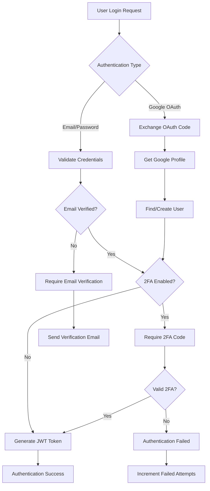

# Design Document: Authentication System Cleanup

## Overview

This design outlines the consolidation of the dual authentication system into a single, enhanced User model that supports both traditional email/password authentication and Google OAuth. The solution eliminates the problematic UserEnhanced model while preserving all existing functionality and adding modern authentication features.

The approach upgrades the existing User.js model with Google OAuth fields and advanced security features, removes the UserEnhanced.js model entirely, and updates all authentication middleware and routes to use the single model. This maintains data integrity while providing a clean, maintainable authentication system.

## Architecture

### Current State (Problematic)
```
┌─────────────────┐    ┌──────────────────────┐
│   User.js       │    │  UserEnhanced.js     │
│   (Original)    │    │  (Google OAuth)      │
├─────────────────┤    ├──────────────────────┤
│ • Basic auth    │    │ • Google OAuth       │
│ • User data     │    │ • 2FA support        │
│ • Twilio creds  │    │ • Email verification │
│ • Phone numbers │    │ • Security features  │
└─────────────────┘    └──────────────────────┘
         │                        │
         └────────┬───────────────┘
                  │
         ┌─────────────────┐
         │ Auth Middleware │
         │ (Dual lookup)   │
         └─────────────────┘
```

### Target State (Clean)
```
┌─────────────────────────────────────┐
│           User.js (Enhanced)        │
├─────────────────────────────────────┤
│ • Email/password auth               │
│ • Google OAuth (googleId, picture)  │
│ • Email verification                │
│ • Two-factor authentication         │
│ • Account security (lockout)        │
│ • All existing user data            │
│ • Twilio credentials                │
│ • Phone numbers                     │
└─────────────────────────────────────┘
                  │
         ┌─────────────────┐
         │ Auth Middleware │
         │ (Single lookup) │
         └─────────────────┘
```

### Authentication Flow


## Components and Interfaces

### Enhanced User Model
The consolidated User model will include all fields from both existing models:

**Core Authentication Fields:**
- `fullName`: User's display name
- `email`: Unique email address (indexed)
- `password`: Hashed password (optional for Google users)
- `role`: User role (user/admin)
- `emailVerified`: Email verification status
- `lastLogin`: Last successful login timestamp

**Google OAuth Fields:**
- `googleId`: Google account identifier (sparse index)
- `profilePicture`: Google profile picture URL

**Email Verification Fields:**
- `emailVerificationCode`: 6-digit verification code
- `emailVerificationExpires`: Code expiration timestamp

**Two-Factor Authentication Fields:**
- `twoFactorEnabled`: 2FA activation status
- `twoFactorSecret`: TOTP secret key
- `twoFactorBackupCodes`: Array of backup codes with usage tracking

**Account Security Fields:**
- `loginAttempts`: Failed login attempt counter
- `lockUntil`: Account lockout expiration timestamp

**Business Data Fields (Preserved):**
- `credits`: User credit balance
- `country`: User's country code
- `currency`: Preferred currency (INR/USD)
- `twilioCredentials`: Twilio account configuration
- `phoneNumbers`: Array of managed phone numbers

### Authentication Service Interface
```javascript
class AuthService {
  // Email verification
  generateEmailVerificationCode(): string
  sendEmailVerificationCode(email: string, code: string, type: string): Promise<boolean>
  
  // Two-factor authentication
  generate2FASecret(userEmail: string): {secret: string, otpauthUrl: string}
  generateQRCode(otpauthUrl: string): Promise<string>
  verify2FAToken(token: string, secret: string): boolean
  
  // Google OAuth
  generateGoogleOAuthURL(state: string): string
  exchangeGoogleCode(code: string): Promise<GoogleUserInfo>
  
  // Security utilities
  generateSessionToken(): string
}
```

### Authentication Middleware Interface
```javascript
interface AuthMiddleware {
  authenticate(req: Request, res: Response, next: NextFunction): Promise<void>
  optionalAuth(req: Request, res: Response, next: NextFunction): Promise<void>
}
```

### Route Handlers Interface
```javascript
interface AuthRoutes {
  signup(req: Request, res: Response): Promise<void>
  login(req: Request, res: Response): Promise<void>
  verifyEmail(req: Request, res: Response): Promise<void>
  resendVerification(req: Request, res: Response): Promise<void>
  googleAuth(req: Request, res: Response): Promise<void>
  googleCallback(req: Request, res: Response): Promise<void>
}
```

## Data Models

### Enhanced User Schema
```javascript
const userSchema = new mongoose.Schema({
  // Core fields
  fullName: { type: String, required: true, trim: true },
  email: { type: String, required: true, unique: true, lowercase: true, trim: true },
  password: { 
    type: String, 
    required: function() { return !this.googleId; },
    minlength: 6 
  },
  role: { type: String, enum: ['user', 'admin'], default: 'user' },
  
  // Google OAuth
  googleId: { type: String, sparse: true },
  profilePicture: { type: String },
  
  // Email verification
  emailVerified: { type: Boolean, default: false },
  emailVerificationCode: { type: String },
  emailVerificationExpires: { type: Date },
  
  // Two-factor authentication
  twoFactorEnabled: { type: Boolean, default: false },
  twoFactorSecret: { type: String },
  twoFactorBackupCodes: [{
    code: String,
    used: { type: Boolean, default: false }
  }],
  
  // Account security
  loginAttempts: { type: Number, default: 0 },
  lockUntil: { type: Date },
  lastLogin: { type: Date },
  
  // Business data (preserved from original User model)
  credits: { type: Number, default: 500 },
  country: { type: String, default: 'IN' },
  currency: { type: String, enum: ['INR', 'USD'], default: 'INR' },
  
  // Twilio integration (preserved)
  twilioCredentials: {
    accountSid: { type: String, default: null },
    authToken: { type: String, default: null },
    apiKey: { type: String, default: null },
    apiSecret: { type: String, default: null },
    twimlAppSid: { type: String, default: null },
    status: { type: String, enum: ['pending', 'active', 'error', 'disabled'], default: 'pending' },
    configuredAt: { type: Date, default: null },
    lastTestedAt: { type: Date, default: null },
    errorMessage: { type: String, default: null }
  },
  
  // Phone numbers (preserved)
  phoneNumbers: [{
    phoneNumber: { type: String, required: true, trim: true },
    label: { type: String, required: true, trim: true, maxlength: 50 },
    assignedAssistantId: { type: String, required: true, trim: true },
    twimlAppSid: { type: String, default: null },
    status: { type: String, enum: ['active', 'inactive', 'error'], default: 'active' },
    configuredAt: { type: Date, default: Date.now },
    errorMessage: { type: String, default: null }
  }],
  
  createdAt: { type: Date, default: Date.now },
  updatedAt: { type: Date, default: Date.now }
});
```

### Database Indexes
```javascript
// Performance indexes
userSchema.index({ email: 1 });
userSchema.index({ googleId: 1 });
userSchema.index({ emailVerificationCode: 1 });

// Virtual for account lock status
userSchema.virtual('isLocked').get(function() {
  return !!(this.lockUntil && this.lockUntil > Date.now());
});
```

## Correctness Properties

*A property is a characteristic or behavior that should hold true across all valid executions of a system-essentially, a formal statement about what the system should do. Properties serve as the bridge between human-readable specifications and machine-verifiable correctness guarantees.*

### Property 1: Single Model Usage
*For any* user operation (create, read, update, authenticate), the system should use only the User model and never reference the UserEnhanced model
**Validates: Requirements 1.1, 1.3, 1.4, 2.3, 8.3, 8.4**

### Property 2: Google OAuth User Creation
*For any* Google OAuth signup, the system should create a User model record with Google credentials and set emailVerified to true
**Validates: Requirements 2.2, 2.5**

### Property 3: Multi-Authentication Support
*For any* user account, the system should support both password-based and Google OAuth authentication methods on the same User model
**Validates: Requirements 2.4**

### Property 4: Email Verification Code Generation
*For any* manual signup, the system should generate a 6-digit verification code and send it to the user's email
**Validates: Requirements 3.1, 3.2**

### Property 5: Email Verification Process
*For any* valid verification code, providing it should mark the user's email as verified and allow login
**Validates: Requirements 3.3**

### Property 6: Unverified Email Login Prevention
*For any* user with unverified email, login attempts should be blocked until email verification is completed
**Validates: Requirements 3.4**

### Property 7: Verification Code Rate Limiting
*For any* user requesting multiple verification codes, the system should enforce rate limiting to prevent abuse
**Validates: Requirements 3.5**

### Property 8: 2FA Setup Generation
*For any* user enabling 2FA, the system should generate a TOTP secret and QR code for authenticator app setup
**Validates: Requirements 4.2**

### Property 9: 2FA Login Requirement
*For any* 2FA-enabled user, login should require a valid TOTP code or backup code in addition to primary credentials
**Validates: Requirements 4.3**

### Property 10: Backup Code Management
*For any* 2FA backup code, it should work for authentication once and then be marked as used to prevent reuse
**Validates: Requirements 4.4, 4.5**

### Property 11: User Data Isolation
*For any* user accessing their data (Twilio credentials, phone numbers, assistant data), the system should return only data belonging to that specific user
**Validates: Requirements 5.2, 5.3, 5.4, 5.5**

### Property 12: Password Security
*For any* password, the system should hash it using bcrypt with 12 salt rounds before storage
**Validates: Requirements 6.1**

### Property 13: JWT Token Configuration
*For any* successful authentication, the system should generate a JWT token with exactly 7-day expiration
**Validates: Requirements 6.2**

### Property 14: Login Rate Limiting
*For any* user making login attempts, the system should enforce a limit of 5 attempts per 15-minute window
**Validates: Requirements 6.3**

### Property 15: Account Lockout Management
*For any* user exceeding 5 failed login attempts, the account should be locked for exactly 2 hours and login responses should indicate lockout status
**Validates: Requirements 6.4, 10.2, 10.3**

### Property 16: Login Attempt Reset
*For any* user with failed login attempts, a successful authentication should reset the failed attempt counter to zero
**Validates: Requirements 6.5, 10.1, 10.4**

### Property 17: OAuth Flow Configuration
*For any* Google OAuth authentication, the system should redirect to the configured callback URL and exchange codes for user profile information
**Validates: Requirements 7.3, 7.4**

### Property 18: OAuth Error Handling
*For any* invalid OAuth code or authentication error, the system should respond with graceful, user-friendly error messages
**Validates: Requirements 7.5**

### Property 19: Existing Functionality Preservation
*For any* existing feature (user roles, preferences, Twilio integration, phone numbers, assistants), it should continue working exactly as before with the single User model
**Validates: Requirements 9.1, 9.2, 9.3, 9.4, 9.5**

### Property 20: Security Event Logging
*For any* security-related event (failed logins, account lockouts, 2FA usage), the system should log the event for monitoring and auditing
**Validates: Requirements 10.5**

## Error Handling

### Authentication Errors
- **Invalid Credentials**: Return 401 with generic "Invalid email or password" message to prevent user enumeration
- **Account Locked**: Return 423 with lockout duration information
- **Email Not Verified**: Return 403 with verification requirement message
- **2FA Required**: Return 200 with requires2FA flag for frontend handling
- **Invalid 2FA Code**: Return 401 and increment failed attempts

### Google OAuth Errors
- **Invalid Authorization Code**: Return 400 with "Google authentication failed" message
- **Network Errors**: Return 500 with "Authentication service temporarily unavailable"
- **Missing Profile Data**: Return 400 with "Unable to retrieve Google profile information"

### Email Verification Errors
- **Expired Code**: Return 400 with "Verification code expired, please request a new one"
- **Invalid Code**: Return 400 with "Invalid verification code"
- **Email Service Failure**: Log error but continue with signup, inform user to check spam folder

### Rate Limiting Errors
- **Too Many Requests**: Return 429 with retry-after header and user-friendly message
- **Account Lockout**: Return 423 with lockout expiration time

### Validation Errors
- **Malformed Input**: Return 400 with specific field validation messages
- **Missing Required Fields**: Return 400 with clear indication of required fields
- **Password Strength**: Return 400 with password requirements

## Testing Strategy

### Dual Testing Approach
The testing strategy employs both unit tests and property-based tests to ensure comprehensive coverage:

**Unit Tests** focus on:
- Specific authentication scenarios and edge cases
- Integration points between authentication components
- Error conditions and boundary cases
- Email verification workflow steps
- 2FA setup and validation flows

**Property-Based Tests** focus on:
- Universal properties that hold across all inputs
- Comprehensive input coverage through randomization
- Security properties that must hold for all users
- Data isolation guarantees across user boundaries
- Authentication flow correctness across all scenarios

### Property-Based Testing Configuration
- **Library**: Use `fast-check` for JavaScript property-based testing
- **Iterations**: Minimum 100 iterations per property test
- **Test Tagging**: Each property test must reference its design document property
- **Tag Format**: `// Feature: auth-system-cleanup, Property {number}: {property_text}`

### Testing Coverage Areas

**Authentication Flow Testing**:
- Email/password authentication with various input combinations
- Google OAuth flow with different user states (new/existing)
- 2FA authentication with TOTP codes and backup codes
- Account lockout and recovery scenarios

**Security Testing**:
- Password hashing verification with bcrypt
- JWT token generation and validation
- Rate limiting enforcement
- Failed login attempt tracking
- Account lockout timing accuracy

**Data Integrity Testing**:
- User data isolation across different users
- Preservation of existing user data during model consolidation
- Twilio credentials and phone number management
- Assistant data association and access control

**Error Handling Testing**:
- Invalid input validation and error responses
- Network failure scenarios in OAuth flow
- Email service failure handling
- Rate limiting and lockout error messages

**Integration Testing**:
- End-to-end authentication flows
- Middleware integration with single User model
- Route handler integration with authentication service
- Database operations with enhanced User schema

The combination of unit and property-based tests ensures both specific scenario validation and comprehensive correctness guarantees across all possible system states and inputs.